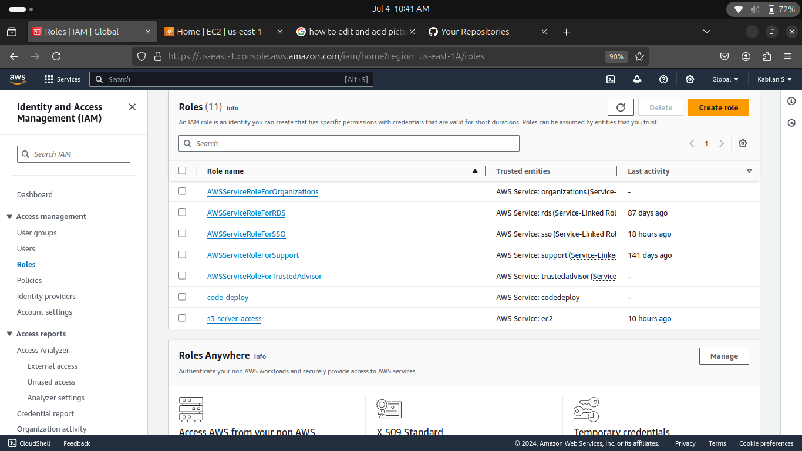
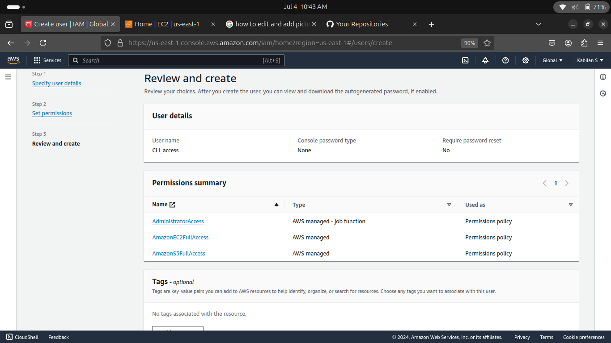

# Deploy-a-sample-application-on-AWS-codeDeploy
Hello Everyone........
Here,I explained and created ,How deploy a sample application on AWS codedeploy

1. From the begning we login into our aws console.Here,we created 2 IAM role.(code-deploy,s3-server-access)
   

2. Then,create a IAM user(assign a CLI access) to push your code on AWS bucket.
   

3. Lets,we create a EC2 instance, this machine is push a code from using this machine
   

4. Login into the EC2 machine using ssh port ,when you create a EC2 machine ,don't forget to attach a security group even by mistake. 

   

5. To access a aws config ,install this credentials
    snap install aws-cli

6. Then ,Launch another EC2 machine for the deploy a sample application
   

   Noticed here I,attached a IAM role which I created.This machine is know as deployment machine.

   

7. After i download a codedeploy agent,we have a file as a install.This file is important to start adeployment process.
   

8. Change a file directory permission chmod +x install,To start a install file,
    ./install auto

   [Alt text]([sample_screenshots/8.png](https://docs.aws.amazon.com/codedeploy/latest/userguide/codedeploy-agent-operations-install-ubuntu.html))

   
10. On the main_server machine ,created a 2 directory use cd comment login to dir.
   Here,I create a yml file and my code(It is just a html code).I attached a code everything on this repository.
   Into the sample dir, I create a 3 documents to_install.sh, to_start.sh, to_stop.sh
   

11. Then,create S3 bucket to store your deployment code
    

    Now,I don't have anything in my s3 bucket.

12. From your main_machine, create application on aws deployment through using this command
    aws deploy create-application --application-name code_to_deploy
    
    At the same time I push my code in aws s3 bucket through using this command
    aws deploy push --application-name code_to_deploy --s3-location s3://viairtel9345deploy/code_to_deploy.zip
    
    Don't confues ,Because I created application name and pushed repository name both are not same.But steps are sam
    
    
14. Then,click a created application and create new deployment group name.Here,you should attach a remaining one IAM role as code_deploy,leave it as remaining default.
     

15. Create a deployment into the deployment group
    

16. Here,chosse your deployment machine,attach a s3 bucket name
    

17. Finally we successfully deploy a sample application.
    
   
    
     NOTE :
    when i was creating a deployment,I got some error.If you get any error same like this,check you code again.
    
    

